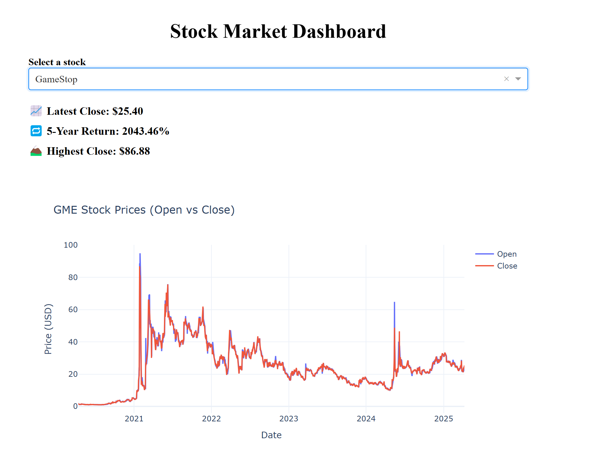
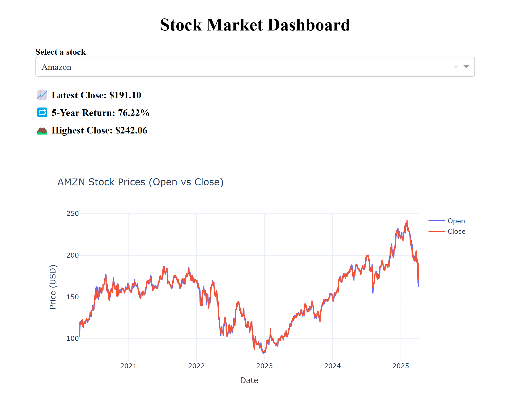

# Stock Market Trend Analysis

This project explores and visualizes historical stock performance for four major companies—**Tesla**, **Amazon**, **AMD**, and **GameStop**—using both a **Jupyter Notebook** and an **interactive Dash web application**. It demonstrates real-world data extraction, time-series analysis, and dashboard development using Python.

---

## Project Overview

As a data analyst at a fictional investment firm, the goal of this project was to create tools that help visualize long-term stock trends and identify investment opportunities. The project consists of:

- **Notebook Analysis**: A structured, annotated data exploration using Jupyter Notebook.
- **Interactive Dashboard**: A real-time Dash app with dropdown-driven plots and KPI summaries.

Both approaches use live financial data pulled from Yahoo Finance via the `yfinance` API.

---

## Features

### Notebook
- Uses `yfinance` to extract 5 years of historical stock data
- Plots Open vs Close prices over time
- Includes markdown commentary and key observations
- Great for exploratory data analysis and storytelling

### Dash App
- Responsive dropdown for selecting a stock
- Dual-line plot for Open and Close prices
- Live-updating KPI section with:
  - Latest Close Price
  - 5-Year Return %
  - Highest Closing Price
- Clean layout using Plotly Dash + HTML/CSS styling

---

## Dash App Preview




---

## Notebook Preview


---

## How to Run

### Notebook
1. Open `notebooks/stock_analysis_notebook.ipynb`
2. Install dependencies:
   ```
   pip install -r requirements.txt
3. Run all cells in Jupyter or VS Code

### Dash App
1. Navigate to the root project folder
2. Run the app:
   ```
   python app/stock_dashboard_app.py
3. Open your browser and go to: http://127.0.0.1:8050/

## Project Structure

stock-market-dashboard/
├── app/
│   └── stock_dashboard_app.py       ← Dash app
├── notebooks/
│   └── stock_analysis_notebook.ipynb ← Jupyter notebook
├── images/
│   └── dashboard_screenshot.png
├── requirements.txt
├── README.md
└── .gitignore

## Tools Used

- Python 3
- Dash
- Plotly
- yFinance
- Pandas
- Matplotlib (notebook only)
- Jupyter Notebook / VS Code

## Future Enhancements

- Add moving average lines or volume overlays
- Include sentiment analysis from financial headlines
- Deploy Dash app to Heroku or Render
- Combine both views into one unified app with tabs